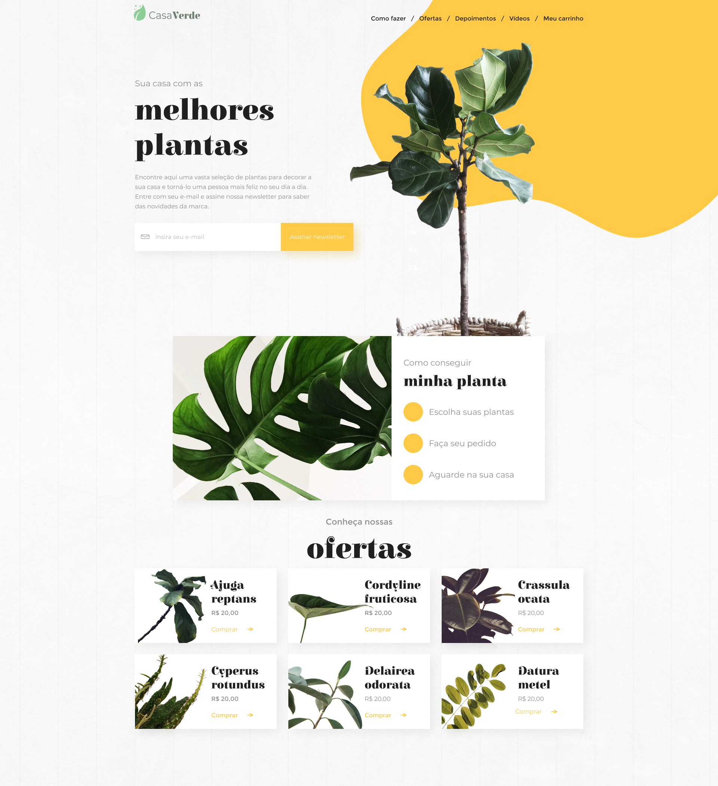

# CasaVerde
``` 
✨ Este projeto foi desenvolvido durante o #7DaysOfCode da Alura.
``` 



## Experiências Práticas
Gostei bastante de desenvolver este projeto, pois nele eu pude por em prática meus conhecimentos em React e o gerenciamento de dependências, TypeScript e Scss. Após este projeto eu me sinto mais seguro para desenvolver outro projetos utilizandos essas ferramentas.


## 🔨 Requisitos
- Implemente os componentes de uma página Figma.
- ~~Transforme CSS em styled components.~~ Eu utilizei Scss.
- Adicione funcionalidades utilizando os React Hooks.
- ~~Envie e-mails para os endereços cadastrados.~~
- Conecte a aplicação a uma API.
- Manipule dados e adapte a sessão de ofertas.
- Faça o deploy da aplicação e finalize o projeto.

<a href='https://7daysofcode.io/'>Acesse o #7DaysOfCode</a>